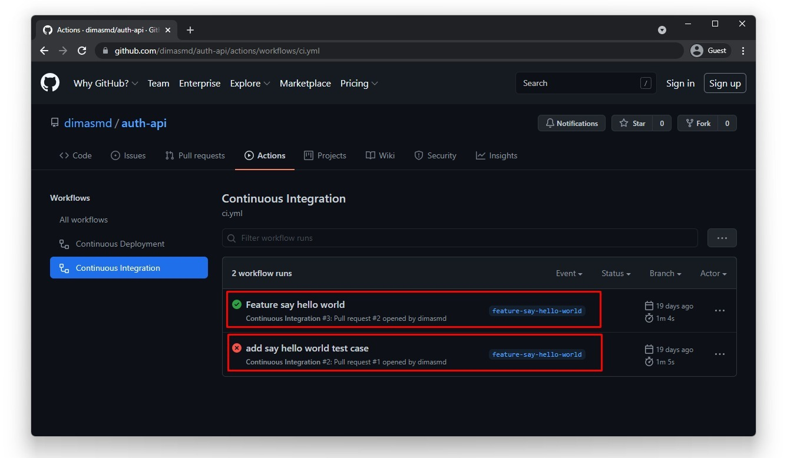
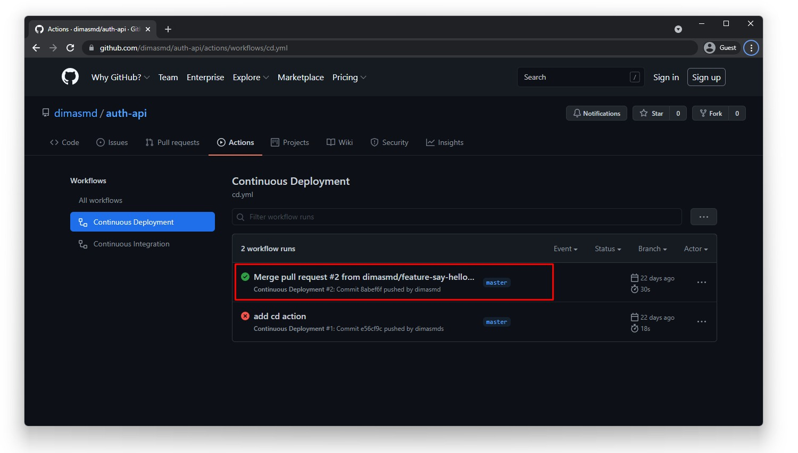

Kriteria Forum API
Terdapat 4 kriteria yang harus Anda penuhi dalam mengembangkan proyek Forum API kali ini.

Menerapkan Continuous Integration
Berikut ketentuannya:

Menjalankan proses pengujian aplikasi secara otomatis, mulai dari Unit Test, Integration Test, hingga Functional Test.
Diterapkan pada event pull request ke branch utama (master/main).
Menggunakan GitHub Actions.
Pastikan Repository Anda memiliki minimal dua proses CI yang sudah berjalan. Satu skenario gagal, dan satu skenario berhasil. Contohnya seperti ini:

Catatan:

Untuk men-trigger CI, Anda harus melakukan pull request terhadap repository.
Silakan buat fitur baru beserta pengujiannya dan lakukan pull request.
Pastikan ada skenario pengujian gagal dan berhasil.
Fitur baru bebas Anda tentukan sendiri. Bahkan, menampilkan pesan Hello World pun boleh. Namun, bila Anda ingin mendapatkan nilai lebih, cobalah kerjakan fitur opsional yang akan dijelaskan nanti.
Integration Test membutuhkan database test yang dapat diakses secara publik. Anda bisa menyediakan database server seperti Amazon RDS namun tidak menutup kemungkinan bila Anda ingin menggunakan service lain.
Atau Jika Anda familiar dengan sistem containerize, Anda bisa manfaatkan PostgreSQL service containers yang tersedia pada GitHub Action, menggunakan container akan lebih cepat karena PostgreSQL dijalankan secara lokal.

Menerapkan Continuous Deployment
Berikut ketentuannya:

Melakukan deploying secara otomatis ke server Anda.
Diterapkan pada event push ke branch utama (master/main).
Pastikan repository Anda memiliki minimal satu proses CD yang sudah berhasil. Contohnya seperti ini:

Catatan:

Proses deployment dilakukan ke server EC2 instance, namun tidak menutup kemungkinan bila Anda mendeploy pada layanan lain.
Proses deployment dapat dilakukan menggunakan SSH untuk GitHub Actions atau mekanisme lain sesuai layanan yang Anda gunakan. Anda juga boleh menggunakan services CodeDeploy bila memanfaatkan EC2 instances.

Menerapkan Limit Access
Forum API harus menerapkan Limit Access agar terhindar dari serangan DDoS Attack, berikut ketentuannya:

Resource yang dibatasi adalah resource /threads dan path yang di dalamnya.
Batasi permintaan yang masuk sebanyak 90 request per menit.
(Baru) Melampirkan file konfigurasi NGINX pada root proyek submission.

Menggunakan Protokol HTTPS
Forum API harus diakses melalui protokol HTTPS agar terhindar dari MITM.

Anda bisa menggunakan subdomain dcdg.xyz atau menggunakan domain Anda sendiri.
Wajib melampirkan URL Forum API Anda pada student notes.
Forum API yang diakses melalui URL HTTPS wajib lulus pengujian Postman.
Catatan: Reviewer akan memeriksa link yang Anda lampirkan. Jadi, harap pastikan link tersebut bisa diakses ya.

Kriteria Opsional Forum API
Selain kriteria utama, terdapat kriteria opsional yang dapat Anda penuhi agar mendapat nilai lebih baik.

Fitur Menyukai dan Batal Menyukai Komentar
API harus dapat menyukai/batal menyukai komentar thread melalui route:

Method: PUT
Path: /threads/{threadId}/comments/{commentId}/likes

Response yang dikembalikan:

Status code: 200
Response body:

{
"status": "success"
}

Ketentuan:

Menyukai dan batal menyukai komentar thread merupakan resource yang dibatasi (restrict). Untuk mengaksesnya membutuhkan access token guna mengetahui siapa yang menyukai komentar.
Untuk menyukai dan batal menyukai diakses melalui method dan route yang sama.
Bila user tidak menyukai komentar, maka aksinya adalah menyukai komentar. Jika user sudah menyukai komentar, maka aksinya adalah batal menyukai komentar.
Jumlah suka (likeCount) pada komentar thread harus ditampilkan pada setiap item comments ketika mengakses detail thread. Contohnya seperti ini:

{
"status": "success",
"data": {
"thread": {
"id": "thread-PJByal62zobLFhUggQo2m",
"title": "sebuah thread",
"body": "sebuah body thread",
"date": "2021-08-13T05:17:12.994Z",
"username": "dicoding",
"comments": [
{
"id": "comment-6ptWTV9l16szB-kTKWvy_",
"username": "dicoding",
"date": "2021-08-13T05:17:13.024Z",
"content": "sebuah comment",
"likeCount": 2
},
{
"id": "comment-_KSz7hz-ox__kqTtCjslD",
"username": "johndoe",
"date": "2021-08-13T05:17:13.057Z",
"content": "sebuah comment",
"likeCount": 1
}
]
}
}
}

Pengujian API
Ketika membangun Forum API, tentu Anda perlu menguji untuk memastikan API berjalan sesuai dengan kriteria yang ada. Kami sudah menyediakan berkas Postman Collection dan Environment yang dapat Anda gunakan untuk pengujian. Silakan unduh berkasnya pada tautan berikut:

Forum API V2 Postman Collection + Environment Test. (isi filenya sudah ada di folder root ini)
D:\laragon\www\Project\Dicoding\Forum API V2 Test\Forum API V2 Test.postman_collection.json
D:\laragon\www\Project\Dicoding\Forum API V2 Test\Forum API V2 Test.postman_environment.json

Cara Import Collection dan Environment Forum API
Silakan unduh tautan yang diberikan di atas.
Ekstrak berkas yang sudah diunduh hingga menghasilkan dua berkas file JSON.
Kemudian import kedua berkas tersebut pada Postman. Caranya, buka aplikasi Postman, klik tombol Import yang berada di atas panel kiri aplikasi Postman.
Kemudian klik tombol Upload Files untuk meng-import kedua berkas JSON hasil ekstraksi.
Pilih kedua berkas JSON hasil ekstraksi dan klik tombol Open.
Kemudian klik Import.
Setelah itu, Forum API V2 Collection dan Environment akan tersedia pada Postman Anda.
Terakhir, Jangan lupa untuk gunakan Environment yang sudah diimpor.

Tips Menjalankan Pengujian Forum API
Pastikan Anda selalu menjalankan pengujian secara berurutan. Karena beberapa request membutuhkan nilai yang didapat dari request sebelumnya. Contoh, pengujian pada folder Authentications membutuhkan folder Users untuk dijalankan. Karena untuk mendapatkan melakukan autentikasi, tentu harus ada data pengguna di database.
Untuk menjalankan request secara berurutan sekaligus, Anda bisa memanfaatkan fitur collection runner.
Kerjakanlah proyek fitur demi fitur, agar Anda mudah dalam menjalankan pengujiannya.
Jika merasa seluruh fitur yang dibangun sudah benar namun pengujiannya selalu gagal, kemungkinan database Anda kotor dengan data pengujian yang Anda lakukan sebelum-sebelumnya, dan itu bisa menjadi salah satu penyebab pengujian selalu gagal. Solusinya, silakan hapus seluruh data (truncate) pada tabel melalui psql.

Kriteria Penilaian Submission
Submission Anda akan dinilai oleh Reviewer guna menentukan kebenaran submission yang Anda kerjakan. Agar dapat melanjutkan pembelajaran, proyek Forum API harus memenuhi seluruh pengujian otomatis pada seluruh Postman Request, terkecuali request yang bertanda [optional]. Bila salah satu pengujiannya gagal, maka proyek Anda akan kami tolak.

Submission Anda akan dinilai oleh Reviewer dengan skala 1-5. Untuk mendapatkan nilai tinggi, Anda bisa menerapkan beberapa saran berikut:

Menyelesaikan kriteria opsional menyukai komentar.
Menyelesaikan kriteria opsional submission sebelumnya yaitu balasan komentar.
Menerapkan functional test (Hapi server test) untuk resource thread dan comment.
Menerapkan 100% Test Coverage.
Menuliskan kode dengan bersih alias mematuhi style guide yang Anda tetapkan.

Berikut adalah detail penilaian submission:

Bintang 1 : Semua ketentuan wajib terpenuhi, namun terdapat indikasi kecurangan dalam mengerjakan submission.
Bintang 2 : Semua ketentuan wajib terpenuhi, namun terdapat kekurangan pada penulisan kode. Seperti tidak menerapkan modularization atau gaya penulisan tidak konsisten.
Bintang 3 : Semua ketentuan wajib terpenuhi, namun tidak terdapat improvisasi atau persyaratan opsional yang dipenuhi.
Bintang 4 : Semua ketentuan wajib terpenuhi dan menerapkan minimal tiga saran di atas.
Bintang 5 : Semua ketentuan wajib terpenuhi dan menerapkan seluruh seluruh saran di atas.

Catatan:
Jika submission Anda ditolak maka tidak ada penilaian. Kriteria penilaian bintang di atas hanya berlaku jika submission Anda lulus.

Ketentuan Pengiriman Submission
Pastikan Anda melampirkan tautan repository proyek dan URL (HTTPS) Forum API Anda pada student notes.
Pastikan repository Forum API Anda bersifat publik bukan privat.
Berkas submission yang dikirim merupakan folder proyek dari Forum API dalam bentuk ZIP.
Pastikan di dalam folder proyek yang Anda kirim terdapat berkas package.json.
Untuk menjaga kredensial Anda, diperbolehkan untuk tidak melampirkan berkas .env selama penamaan variable environment sesuai dengan yang ada pada starter project submission sebelumnya.
Pastikan Anda hapus dulu berkas node_modules pada folder proyek sebelum mengkompresi dalam bentuk ZIP.

Submission Anda akan Ditolak bila
Kriteria wajib Forum API tidak terpenuhi.
Ketentuan berkas submission tidak terpenuhi.
Proyek yang Anda kirim tidak dapat dijalankan dengan baik (Reviewer menggunakan Node.js versi LTS v22).
Menggunakan bahasa pemrograman dan teknologi lain, selain JavaScript atau TypeScript dan Node.js.
Menggunakan Framework Node.js selain Hapi Framework.
Melakukan kecurangan seperti tindakan plagiasi.
